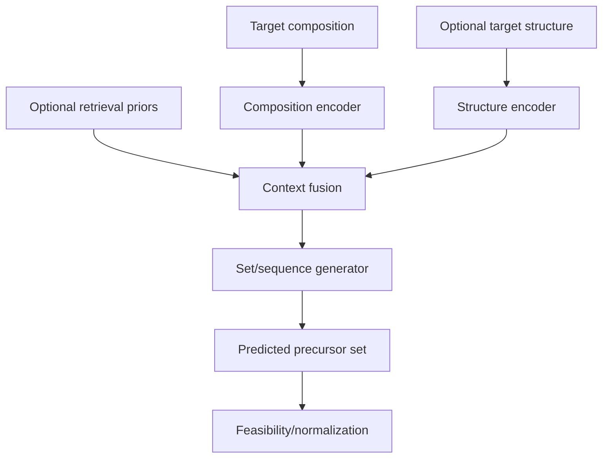

# Conceptual Pipeline (Non-enabling)

## Goal

Given a target material (composition, and optionally structure), predict a **set of precursor materials** whose combined chemistry is consistent with synthesizing the target.

## Component roles

1. **Target encoder (composition)**
   - Converts a chemical formula into a fixed-length compositional descriptor vector.

2. **Optional target encoder (structure)**
   - When structural data is available, maps the crystal geometry to a fixed-length structural embedding.

3. **Context retrieval (optional priors)**
   - Retrieve a small set of historically observed synthesis “neighbor” contexts.
   - These neighbors provide priors about common precursor families and decomposition pathways.

4. **Combinatorial sequence/set generator**
   - Uses an encoder-decoder generative architecture to produce precursor tokens autoregressively.
   - The output is interpreted as an unordered set (variable size), not a fixed-length string.

5. **Feasibility + normalization**
   - Conceptual normalization of precursor tokens.
   - Lightweight feasibility checks (e.g., element coverage plausibility) may be applied.

## Information flow (conceptual)

